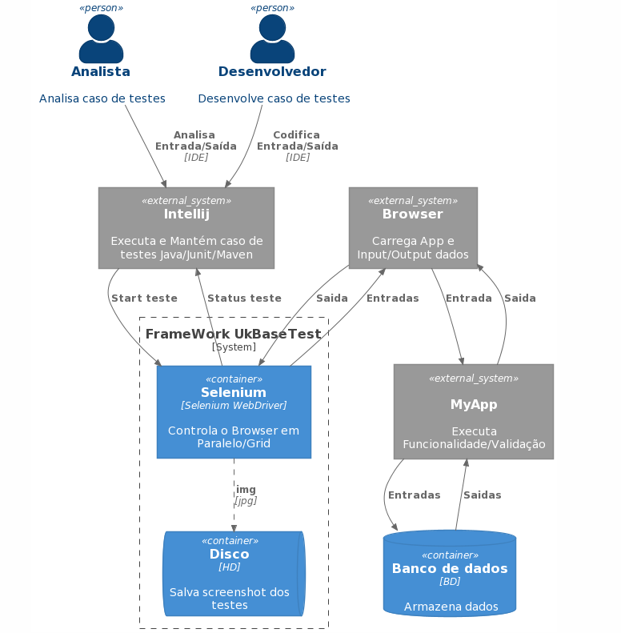

# UkalikoBaseTest
Repositorio do framework de testes UkalicoBaseTest. Sendo o Framework a abstração que serve de estrutura para o projeto visando reuso e padronização, vantagens nativas:
- Driver centralizado
- Herança de compotamentos
- Reuso do browser
- Scheenshot ao final dos testes
- Chaveamento para outros browsers
- PADRONIZAÇÃO de projeto de longo prazo

Focado na solução para os 3 maiores motivos de problemas nos testes funcionais:
Localização de elementos, Sincronismo dos scripts e Massa de dados.
  

# Arquitetura framework UkBaseTest



# Stack
- Java 1.8
- Selenium-java 4.1.0
- Selenium-server-standalone 3.5.3
- Junit 4.13.2
- Maven-surefire-plugin 2.18.1
- Selenium-chrome-driver 4.1.0
- Commons-io 2.11.0
- Apache Maven 3.8.3
- PlantUML 
	
	
# Estrutura do projeto

```
UkalicoBaseTest
|_arq 
|_img
|_src
|   |_test
|      |_core
|      |  |_core
|      |  |_pages
|      |  |_testes
|      |  |_utils
|      |_suites
|      |_myapp
|      |  |_core
|      |  |_pages
|      |  |_tests
|      |_resources
|	    |_driver
|	    |_grid
|  
|_target
|   |_screanshot	 
|   
|pom.xml
|README.md   
|.gitignore
```
